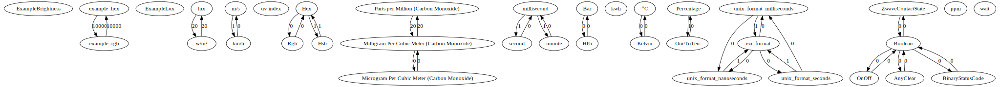

# API to convert between values
## Endpoints
### /conversions
### /extended-conversions
### /validate/extended-conversions

# expressions usable in extensions send to /extended-conversions

## govaluate documentation
https://github.com/Knetic/govaluate#what-operators-and-types-does-this-support
https://github.com/Knetic/govaluate/blob/master/MANUAL.md

## custom functions

### atoi

- parses string as integer
- signature: func(string)int64
- example: `atoi(x) == 42`

### atof

- parses string as float
- signature: func(string)float64
- example: `atof(x) == 42.13`

### ntoa

- formats number as string
- signature: func(number)string; number may be int, int16, int32, int64, float32, float64
- example: `ntoa(x) == "42"`

# default conversions
to get a graph of possible conversions, call
```
go generate ./...
```
which prints a dot graph. you can use https://dreampuf.github.io/GraphvizOnline to generate images from the output.  



# known dependent repositories

- https://github.com/SENERGY-Platform/marshaller
- https://github.com/SENERGY-Platform/external-task-worker
- https://github.com/SENERGY-Platform/mgw-external-task-worker
- https://github.com/SENERGY-Platform/device-command